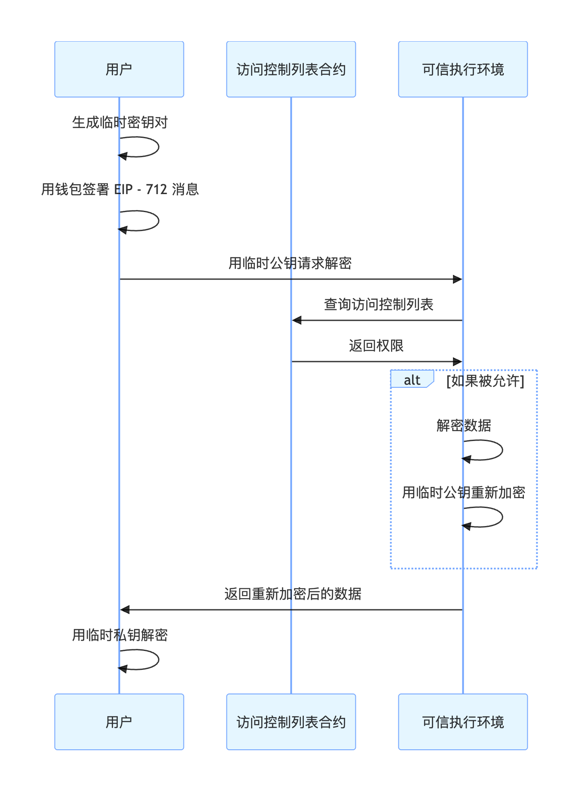
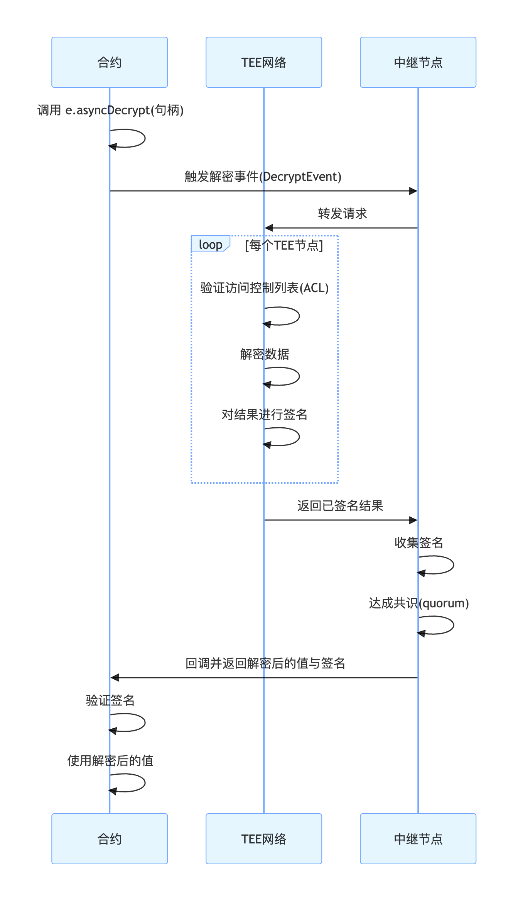

# 解密机制
Inco 提供两种解密机制：
- 重加密用于私密解密和查看
- 链上解密用于解密密文并向全网公开

## 重加密（查看）
用于用户希望查看其机密数据时：
1. 用户签署一条 EIP-712 消息以证明其钱包所有权
2. 客户端生成临时密钥对
3. 用户发送包含签名消息和临时公钥的解密请求
4. 解密节点验证签名并检查访问控制
5. 解密节点使用用户的临时公钥重新加密数据，确保传输过程中无信息泄露
6. 用户使用临时私钥解密结果

## 链上解密（公开披露）
当结果需要在链上可用时使用：
1. 智能合约调用 e.asyncDecrypt(encryptedValue)
2. 解密网络监控解密事件
3. 解密网络查询访问控制列表以验证权限
4. 每个解密网络节点解密数值并对结果进行签名
5. 中继器收集签名并向合约提交回调
6. 智能合约验证签名并使用解密后的数值

